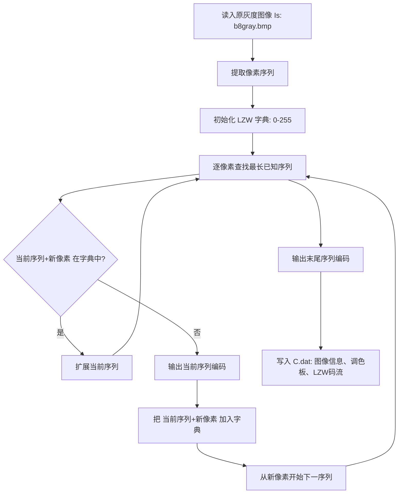
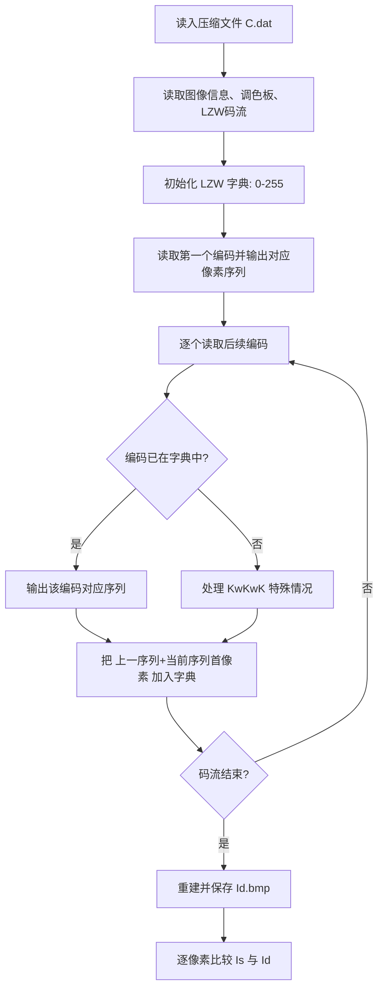

# 实验三：LZW 编解码实验

## 一、实验目标

对灰度图像 `b8gray.bmp` 进行 LZW 编码，输出压缩文件 `C.dat`；再以 `C.dat` 为输入进行 LZW 解码，输出解码图像 `Id.bmp`。计算编码后的 bpp 值、原灰度图像的熵，并验证原图 `Is` 与解码图 `Id` 是否完全相同。

## 二、编码框图



## 三、编码代码

编码代码位于 `Task3/main.cpp`，核心函数为：

- `LzwEncode(...)`：完成 LZW 字典编码。
- `SaveCompressedFile(...)`：保存 `C.dat`，其中包含图像尺寸、调色板和 16 bit LZW 码流。
- `CalculateEntropy(...)`：计算原图灰度熵。

## 四、解码框图



## 五、解码代码

解码代码位于 `Task3/main.cpp`，核心函数为：

- `LoadCompressedFile(...)`：读取 `C.dat`。
- `LzwDecode(...)`：按 LZW 规则恢复像素序列。
- `PutImageBytes(...)`：根据解码像素和调色板生成 `Id.bmp`。
- `SameImage(...)`：验证原图与解码图是否完全一致。

## 六、实验结果

本次运行命令：

```bat
build.bat
lzw_task3.exe
```

实际输出：

| 项目 | 结果 |
| --- | ---: |
| 输入图像 | `b8gray.bmp` |
| 图像尺寸 | `1314 x 1666` |
| 原始像素数 | `2189124` |
| LZW 编码数量 | `765705` |
| 编码后 bpp（仅码流） | `5.596430` |
| 编码后 bpp（含 C.dat 文件头） | `5.600275` |
| 原灰度图像熵 | `7.528544 bit/pixel` |
| `Is` 与 `Id` 是否相同 | `YES` |

程序生成文件：

- `C.dat`：LZW 压缩文件。
- `Id.bmp`：由 `C.dat` 解码得到的图像。
- `result.txt`：实验运行结果。

## 七、附录

除 `HXLBMPFILE` 类以外的实验三代码见 `Task3/main.cpp`。
